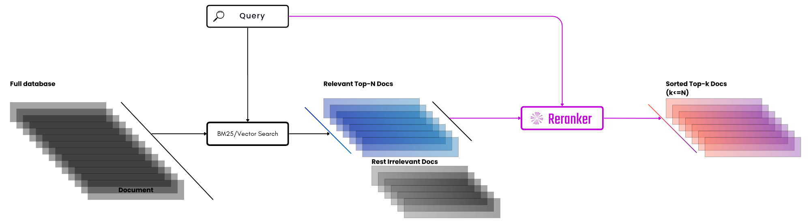

# Building a Search Engine for Tübingen

Welcome to the Tübingen Search Engine project repository! This project aims to build a search engine focused on
Tübingen, integrating web crawling, information retrieval, and a modern web interface.

This repository is part of the coursework deliverable for the **Modern Search Engines** course at the **University of Tübingen** during the **2024 Summer semester**.

 
Visualization source: [Jina AI](https://jina.ai/reranker)

 

## Project Structure

The project is organized into the following directories:

- **/src**: Contains the core Python code for web crawling (`/crawler`) and information retrieval (`/retriever`).
- **/frontend**: Houses the React/Next.js application for the web interface.
- **/backend**: Includes the FastAPI-based backend server code.

### Crawling

The main crawler can be found in the `/src/crawler` directory. The crawler is responsible for fetching web pages,
extracting text content, and storing the data.

### Information Retrieval

The information retrieval system is located in the `/src/retriever_v2` directory. It includes the indexing and search
components. The ensemble retrieval model combines the BM25, embedding-based, and NLI-based retrieval models. The code
can be found in the `/src/retriever_v2/main.py` directory.

## Getting Started

Follow these instructions to set up and run the Tübingen Search Engine locally.

### Prerequisites

- Python 3.x (recommended: Python 3.10+)
- Node.js (recommended: Node.js 20.14+)
- npm (Node Package Manager)

Additionally, you need to have the document text files in the `/src/retriever_v2/index/docs` directory and the
frontier dataset in the `/src/retriever_v2/index/index.csv`.

### Installation

#### 1. Clone the Repository

Clone the repository to your local machine:

```bash
git clone https://github.com/baz2z/mse-group-project.git
cd mse-group-project
```

#### 2. Install requirements

##### a. Python Dependencies

From the root directory, install the Python dependencies:

```bash
pip install -r requirements.txt
```

##### b. Node.js Dependencies

Navigate to the `frontend/` directory and install Node.js dependencies:

```bash
cd frontend/
npm install
```

This installs the required npm packages for the React/Next.js frontend.

## Running the Project

### Start the Backend Server

In the `backend/` directory, start the FastAPI server:

```bash
uvicorn app:app --reload
```

This command launches the backend server with auto-reloading enabled for development. The server will be accessible
at [http://localhost:8000](http://localhost:8000).

**Start the Frontend Development Server**

In the `/frontend` directory, start the React/Next.js development server:

```bash
npm run dev
```

Open your browser and navigate to [http://localhost:3000](http://localhost:3000) to view the Tübingen Search Engine.
